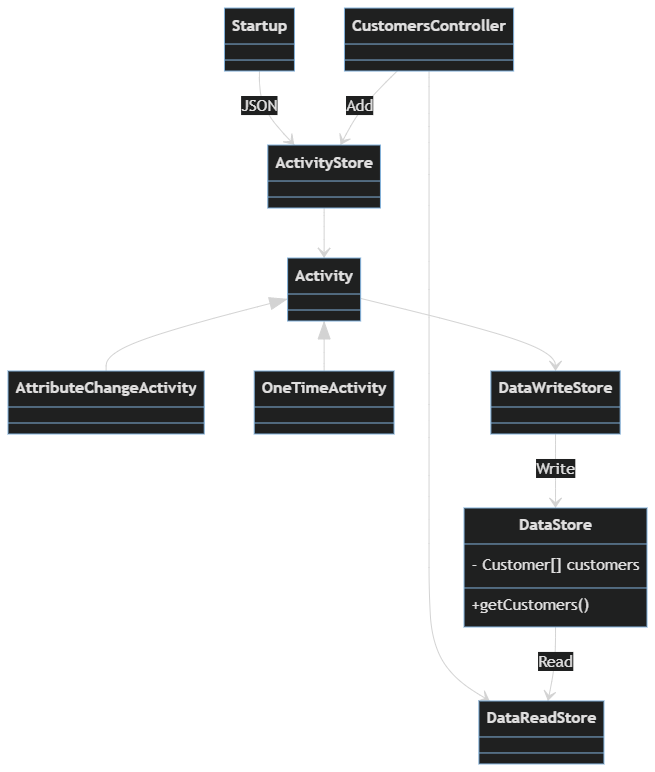

# customer-challenge-ui

This README outlines the details of collaborating on this ASP.NET Core Web API application.
This app fetches the customer data from the server and allows the user to view and edit the customer record through REST api. You can add or remove the customer properties.

## Prerequisites

You will need the following things properly installed on your computer.

* [Git](https://git-scm.com/)
* [.NET 5.0](https://dotnet.microsoft.com/en-us/download/dotnet/5.0)
* [Visual Studio](https://visualstudio.microsoft.com/vs/community/)

## Installation

* `git clone <repository-url>` this repository
* `cd CustomerioChallenge`
* `dotnet build`

## Running / Development

* `cd CustomerioChallenge.Web`
* Go to file `\CustomerioChallenge\CustomerioChallenge.Web\Startup.cs` and change the path of `messages.1.data` file if needed. You can put absolute path if relative path do not work.
* `dotnet run`
* Visit Swagger UI at [http://localhost:5000/swagger/index.html](http://localhost:5000/swagger/index.html).
* try `dotnet help` for more details

### Running Tests

* Go back to root folder 'CustomerioChallenge' [ `cd ..` ]
* `dotnet test`

## Known issues

* `POST` and `PATCH` requests are not yet implemented

### Future work

* Better testing (probably remove static classes)
* Error handling and logging

## Class diagram

Class diagram for CustomerioChallenge.Web project

